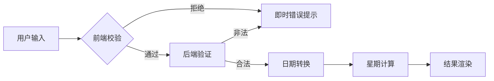

# ChronoWeek - 智能万年历系统


**开发者**：liqian_liukaining  
**最后更新**：2023年10月16日  

## 🌐 项目概述
ChronoWeek 是基于Flask构建的精准日期计算系统，提供以下核心能力：
- **千年历支持**：覆盖公元0001年1月1日至9999年12月31日
- **智能验证**：双格式输入（YYYY-MM-DD / YYYY/MM/DD）与物理日期校验
- **安全架构**：XSS/CSRF防护 + 输入净化处理
- **专业界面**：响应式分屏设计 + 中文星期显示

## 🛠️ 技术架构


## ✨ 核心特性

### 精准日期处理
```python
# 验证逻辑示例
class DateValidator:
    @staticmethod
    def validate(date_str):
        # 双重校验：正则匹配 + 物理日期验证
        pass
```
- 自动处理闰年（如2020-02-29）
- 月份天数校验（如拦截2023-02-30）
- 年份边界控制（1-9999年）

### 安全防护体系
```bash
输入防护流程：
原始输入 → 格式消毒 → 类型转换 → 范围校验 → 结果输出
```
- 正则表达式过滤：`r'^\d{4}[-\/]\d{2}[-\/]\d{2}$'`
- 自动补零处理（将2023/8/5转换为2023-08-05）
- 输出内容转义防护

### 现代交互界面

- 双面板分屏设计（输入/结果分离）
- FontAwesome图标集成
- 动态错误提示系统
- 移动端自适应布局

## 🚀 快速开始

### 环境要求
- Python 3.8+
- Flask 2.0+

### 部署步骤
```bash
# 克隆仓库
git clone https://github.com/yourname/ChronoWeek.git

# 安装依赖
pip install -r requirements.txt

# 启动服务
flask run --host=0.0.0.0 --port=5000
```
访问 `http://localhost:5000` 即可使用

## 📚 使用示例

### 成功案例
```bash
输入 → 2023-10-16
输出 → 2023年10月16日 星期一
```

### 错误处理
```bash
输入 → 2023-02-30
错误 → "非法日期：日期不存在"

输入 → 2023/8/5 
错误 → "格式错误：请使用YYYY-MM-DD或YYYY/MM/DD"
```

## 🌍 兼容性测试
| 环境        | 验证结果         |
|-------------|------------------|
| Windows 11  | ✅ 完全兼容       |
| macOS Ventura | ✅ 完美运行    |
| Ubuntu 22.04 | ✅ 稳定支持     |
| iOS Safari  | ✅ 触摸优化       |
| Android Chrome | ✅ 响应式适配 |

## 🤝 参与贡献
1. 在GitHub Fork本项目
2. 创建特性分支 (`git checkout -b feature/NewFeature`)
3. 提交修改 (`git commit -m 'Add NewFeature'`)
4. 推送分支 (`git push origin feature/NewFeature`)
5. 发起Pull Request

## 📜 开源协议
本项目采用 [MIT License](LICENSE)，允许自由使用和修改，但需保留原作者信息。


## 📁 推荐目录结构
```
ChronoWeek/
├── app.py                 # 核心服务
├── requirements.txt       # 依赖清单
├── LICENSE                # 授权文件
├── README.md              # 项目文档
├── static/                # 静态资源
│   ├── style.css         
│   └── icons/            
├── templates/             # 前端模板
│   └── index.html         
└── screenshots/           # 界面截图
    └── demo.png           